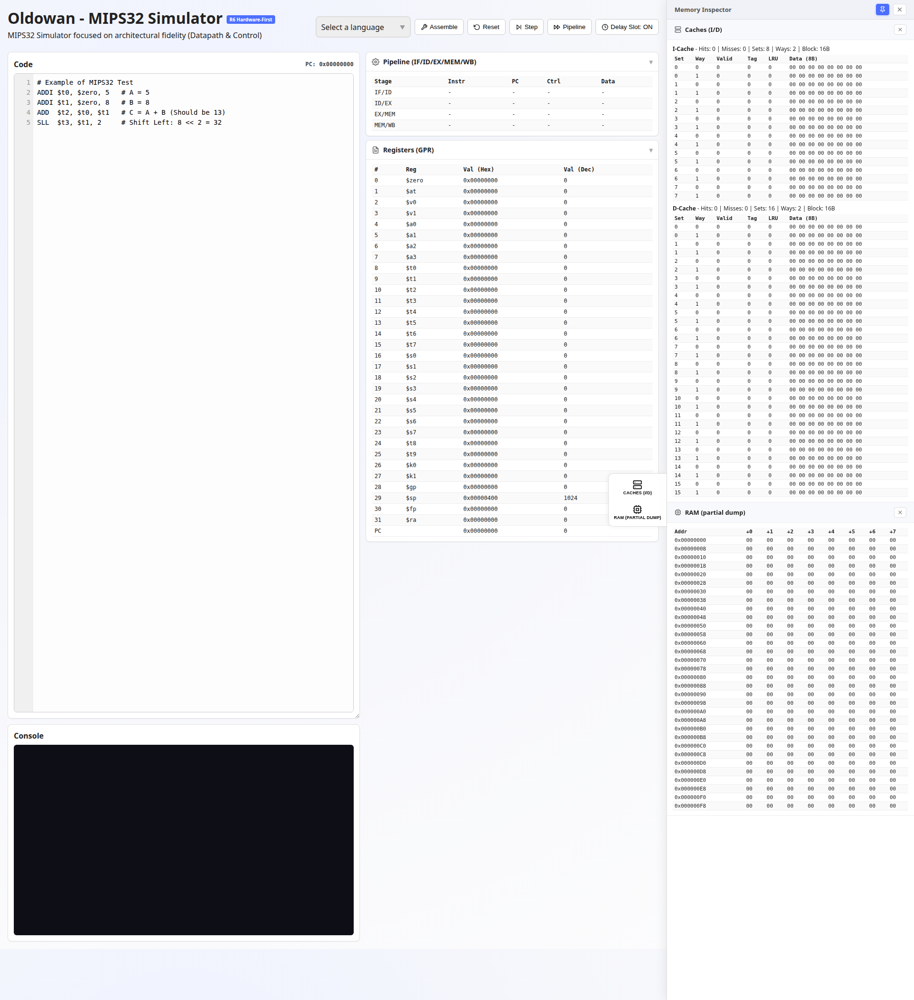
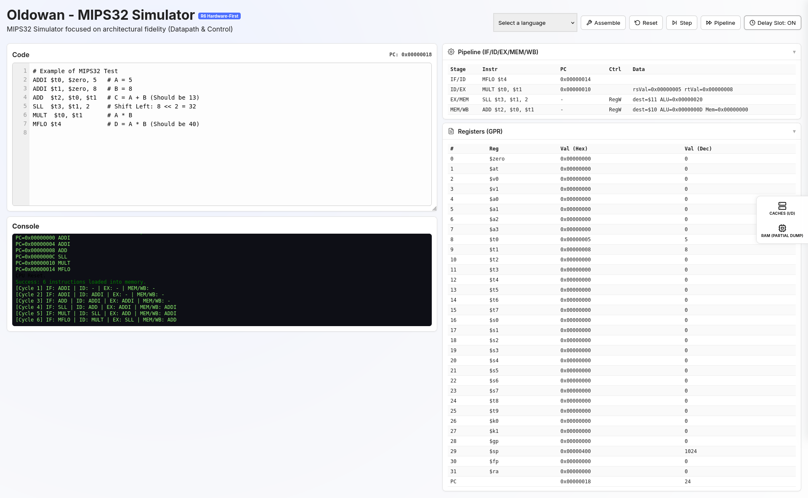

<p align="center">
  <h1 align="center">🪨 Oldowan</h1>
  <p align="center">
    <strong>A Hardware-First MIPS32 Educational Simulator</strong>
    <br />
    <em>See the datapath. Understand the machine.</em>
  </p>
  <p align="center">
    <a href="#features">Features</a> · 
    <a href="#quick-start">Quick Start</a> · 
    <a href="#architecture">Architecture</a> · 
    <a href="#screenshots">Screenshots</a> · 
    <a href="#roadmap">Roadmap</a> · 
    <a href="#license">License</a>
  </p>
</p>

---

## Why Oldowan?

Most MIPS simulators treat the CPU as a black box - you write assembly, it runs, you see the result. **Oldowan opens the box.** 

Built for Computer Architecture courses, Oldowan simulates the MIPS32 processor at the **datapath and control signal level**. Every instruction decode, ALU operation, and pipeline stage mirrors what happens in real hardware - not through abstracted interpreter logic, but through the same control signals you find in Patterson & Hennessy's textbook diagrams.

> *Named after humanity's oldest stone tool tradition (~2.6 million years ago), Oldowan represents the foundational step in understanding how processors work - just as those first tools were the foundational step in technology.*

---

## Features

### Hardware-First Simulation
- **Control Signal Decode** - Instructions are decoded through a Main Control ROM indexed by opcode, producing real control signals (`RegDst`, `ALUSrc`, `MemToReg`, `RegWrite`, `Branch`, etc.)
- **Discrete ALU** - Individual circuit functions for each operation (`circADD`, `circSUB`, `circSLL`...) with proper overflow detection via sign-bit analysis, dispatched through a MUX table
- **Separate MDU** - Multiply/Divide Unit operates independently from the ALU, using 64-bit precision via `BigInt` for exact `HI:LO` results
- **ALU Control Unit** - Secondary control unit translates `ALUOp + Funct` into ALU control lines, just like the hardware truth table

### 5-Stage Pipeline with Forwarding
- Physical inter-stage latches (`IF/ID`, `ID/EX`, `EX/MEM`, `MEM/WB`) with all real fields
- **Data Forwarding Unit** - Resolves RAW (Read After Write) hazards with correct priority (EX hazard > MEM hazard)
- **Hazard Detection** - Load-use stalls with automatic bubble insertion
- Clock-edge simulation - stages execute in reverse order (WB ← MEM ← EX ← ID ← IF)

### Configurable Fidelity
| Config               | ON                                          | OFF                                |
| -------------------- | ------------------------------------------- | ---------------------------------- |
| **Delay Slot**       | Classic MIPS behavior (delay slot executes) | Immediate branch (MARS/SPIM style) |
| **Forwarding**       | Data forwarding active                      | Pipeline requires stalls (NOPs)    |
| **Hazard Detection** | Hardware interlocks for load-use            | Programmer responsibility          |

Toggle each setting to demonstrate the impact of hardware mechanisms in class.

### Complete MIPS32 ISA (Base)
- **R-Type**: ADD, ADDU, SUB, SUBU, AND, OR, XOR, NOR, SLT, SLTU, SLL, SRL, SRA, SLLV, SRLV, SRAV, JR, JALR, MULT, MULTU, DIV, DIVU, MFHI, MFLO, MTHI, MTLO, SYSCALL
- **I-Type**: ADDI, ADDIU, ANDI, ORI, XORI, SLTI, SLTIU, LUI, LW, LH, LHU, LB, LBU, SW, SH, SB, BEQ, BNE, BLEZ, BGTZ
- **J-Type**: J, JAL

### Memory Hierarchy
- **Set-Associative Caches** - Separate I-Cache and D-Cache with LRU replacement, configurable size/associativity/block size
- **Big-Endian Memory** - Native `DataView` operations for MIPS-correct byte ordering
- **Alignment Checks** - Hardware-accurate Address Error exceptions for misaligned accesses
- **Write-Through** policy with write-allocate on miss

### Modular Extension System
- **MSA (SIMD) Extension** - 30+ vector instructions defined with full bit-pattern encoding (integration in progress)
- Extensions are self-contained in separate constants files
- New instructions registered via metadata, not hardcoded switch-cases

---

## Quick Start

Oldowan requires **no installation, no build step, no dependencies**. It runs entirely in your browser:

### **→ [Open Oldowan](https://jaosoares2.github.io/Oldowan/)**

That's it. Write MIPS assembly, click **Assemble**, and step through execution. Everything runs **100% locally in your browser**.

<details>
<summary><strong>For developers: running locally</strong></summary>

```bash
git clone https://github.com/JaoSoares2/Oldowan.git
cd Oldowan
python3 -m http.server 8000
# → http://localhost:8000
```
</details>

---

## Screenshots

<p align="center">
  
  <br />
  <em>Clean interface - Code editor, Pipeline stages, Register bank, Caches, RAM, and Console</em>
</p>

<p align="center">
  
  <br />
  <em>Pipeline in action - Instructions flowing through stages with control signals and forwarded data visible</em>
</p>

---

## Architecture

Oldowan is built as **pure vanilla JavaScript (ES6 modules)** with zero external dependencies:

```
js/
├── execution.js          # Datapath - monocycle (step) & 5-stage pipeline engine
├── instructions.js       # InstructionRegistry - hardware-first decode & Main Control ROM
├── constants.js          # MIPS32 ISA definitions using full bit-patterns
├── constantsMSAExtension.js  # MSA SIMD extension (modular)
├── constantsALU.js       # ALU operation codes
├── controlALU.js         # ALU Control Unit (truth table: ALUOp + Funct → ALU Code)
├── alu.js                # ALU with discrete circuit functions & flag generation
├── mdu.js                # Multiply/Divide Unit (separate from ALU, 64-bit via BigInt)
├── assembler.js          # Two-pass assembler with syntax-driven encoding
├── memory.js             # Load/Store via DataView (Big-Endian native)
├── cache.js              # Set-associative cache with LRU replacement
├── state.js              # CPU state (registers, pipeline latches, caches, config)
├── main.js               # UI controller & rendering
├── parse.js              # Register & immediate parsing
├── encode.js             # Bit-field encoding helpers
└── decode.js             # Instruction word field extraction
```

### Design Principles

1. **Signals, not names** - The decode path uses opcodes and control signals, not instruction name strings
2. **Stateless modules** - Most modules export pure functions; state is centralized in `state.js`
3. **No bundler** - Direct ES6 module imports; source is inspectable in the browser DevTools
4. **ISA as data** - Instructions are defined by their full 32-bit pattern; the registry auto-computes mask/match

---

## Roadmap

- [ ] Pseudo-instructions (`LA`, `LI`, `MOVE`, `NOP`)
- [ ] Enhanced SYSCALL (print_int, print_string, read_int - MARS-compatible)
- [ ] Visual datapath diagram (SVG/CSS) with animated forwarding paths
- [ ] Register change highlighting on step
- [ ] Code editor with line numbers and instruction highlighting
- [ ] Instruction binary format viewer (opcode/rs/rt/rd/funct breakdown)
- [ ] MSA extension execution handlers


---

## Tech Stack

|                     |                                            |
| ------------------- | ------------------------------------------ |
| **Language**        | Vanilla JavaScript (ES6 Modules)           |
| **Styling**         | CSS3 with Grid Layout                      |
| **Dependencies**    | None                                       |
| **Build Step**      | None                                       |
| **Browser Support** | Any modern browser with ES6 module support |


## License

Distributed under the MIT License. See [LICENSE](LICENSE) for details.

**Copyright © 2026 João Víctor Soares**
